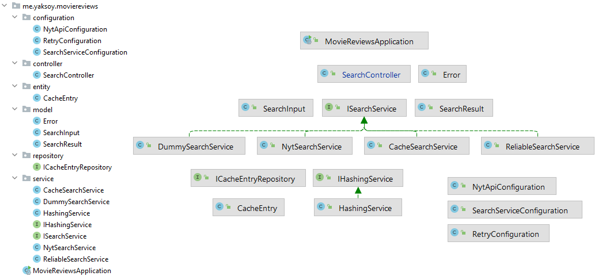
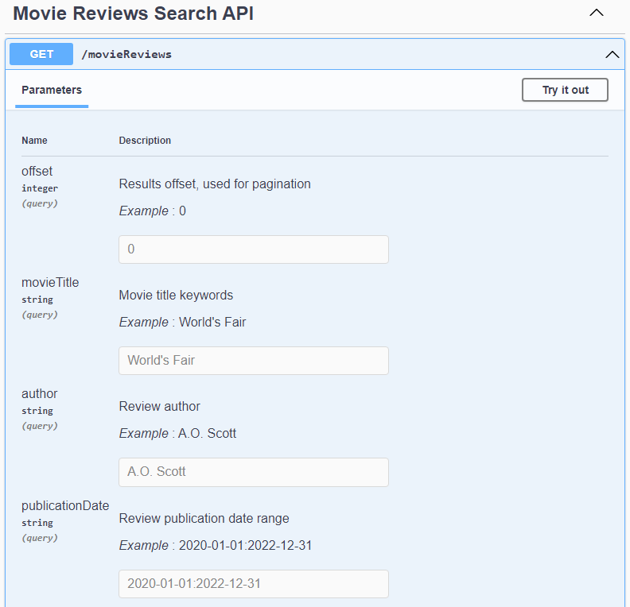

# Movie Reviews API

> REST API which provides an endpoint for retrieving and searching movie reviews.

> The New York Times' Movie Review API service is used to fetch the results.
> Fetched results are cached based on specific conditions in order to improve performance.
> Retry mechanisms are implemented so that the API has improved reliability.

## Features, tech stack

* Highly modular
* Retry mechanism
* Caching search results
* NYT API client generation
* OpenAPI specification generation/Swagger UI endpoint
* Unit tests
* Containerization
* Java, Spring, MongoDB, JUnit, Mockito, Swagger, Docker

## Requirements

Docker, or Java 8 with a running MongoDB instance.

## Running with Docker

```
mvn clean package -DskipTests=true
```

Specify your API Key in the `.env` file, and then run:

```
docker compose build
```

```
docker compose up
```

## Usage

`GET` request to [http://localhost:8080/api/movieReviews](http://localhost:8080/api/movieReviews).

Possible query parameters:

* `offset`: used for pagination
* `movieTitle`: movie title keywords
* `author`: review author
* `publicationDate`: review publication date range

Example: [http://localhost:8080/api/movieReviews?offset=0&movieTitle=World's Fair&author=A.O. Scott&publicationDate=2020-01-01:2022-12-31](http://localhost:8080/api/movieReviews?offset=0&movieTitle=World%27s%20Fair&author=A.O.%20Scott&publicationDate=2020-01-01%3A2022-12-31)

## Codebase overview



## [Swagger UI](http://localhost:8080/swagger-ui/index.html)



## Testing

```
mvn clean test "-Dnyt.api.key=<API_KEY>"
```
